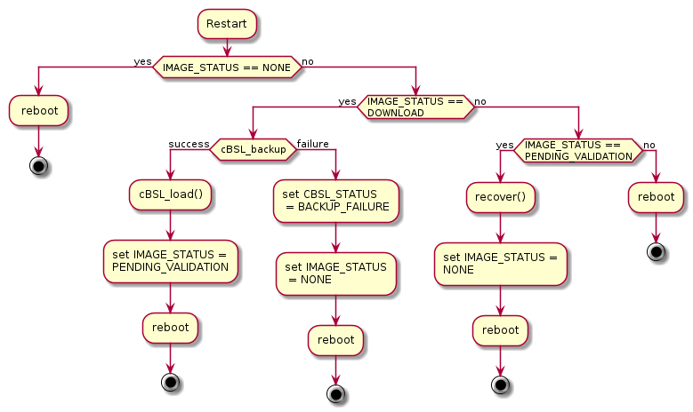

# MSP430-OTP

MSP430f5xxx Over The Air Programming.

# Notice

This code does not yet work, I am looking for contributors.  If you would like to help, please communicate with me via issues.

## Revisions

### v0.0.2
Compiler: TI v4.3.5 3/6/2015

1. Updated README.md, changed ther overall sequence.

### v0.0.2
Compiler: TI v4.3.5 3/6/2015

1. Added serial.c library

### v0.0.1
Compiler: TI v4.3.5 2/26/2015

1. Sorted out the lnk_msp430f5335.cmd
2. Removed Files that may not be needed
3. System can now compile

### v0.0.0
Compiler: TI v4.3.5 2/25/2015
Initial Commit

## Requirements:

Code Composer Studio V6+ (CCS6) and msp430f5xxx uC

## Terminology

**cBSL** Custom BSL, resides in BSL area of the MSP430 Memory, this section is persistent and does not get updated over the life of the product.

**Application** Application code, resides in FLASH and FLASH2 area.  The application code gets updated.

**Current Image** Image that is currently running

**New Image** Downloaded image ready for deployment

**Program Region** Flash memory region where the current running application resides

**Backup Region** Flash memory region where backup of the Program Region is located

**Download Region** Flash memory region to where new Application is written.

**Image Status** - 16 bit register, can be one of the following:

1. 0x00EE - *NONE* - No activity, nothing to be done
2. 0x00CC - *DOWNLOAD* - New Image in Download Area
3. 0xFF88 - *PENDING_VALIDATION* - Waiting to be validated by application.
4. 0x0088 - *VALIDATION*

## Usage

1. Clone the directory into you project.
2. Adjust the lnk_msp430f5xxx.cmd file.
3. Add OTP and Production build configuration to CCS6

## BSL and The Application

This BSL will be part of the project, this way the production has to flash the uC only once.  The project will have two build configurations:

1. *OTP* - The hex will include onlye the Application, Server will upload this hex over the air.
2. *Production* - The hex will include the BSL and the Application for production flashing.

## BSL Role

The BSL will have the following functions:

1. **cBSL_main()**    - main BSL function
2. **cBSL_backup()**  - Backup the current Application
3. **cBSL_recover()** - Recover the Application from Backup
4. **cBSL_load()**    - Load new application

The BSL will be able to set image status to the following:

1. *PENDING_VALIDATION*, indicating to the application that this is the new image, it needs to be validated.

The following is the activity diagram of the process:

## Application Role

The Appliation will:

1. Download the new image to the *New Image* region and perform data integrity check.

The Application will be able to set image status to the following:

1. **None** - Once validation is completed, the image status is set to none.
2. **Download** - Once the new image has been written and the data integrity check was passed by the Application.

